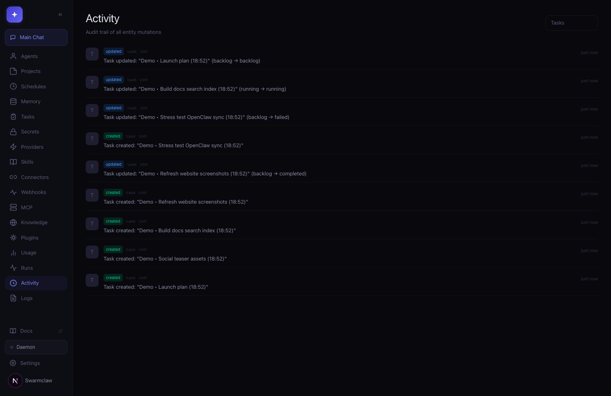
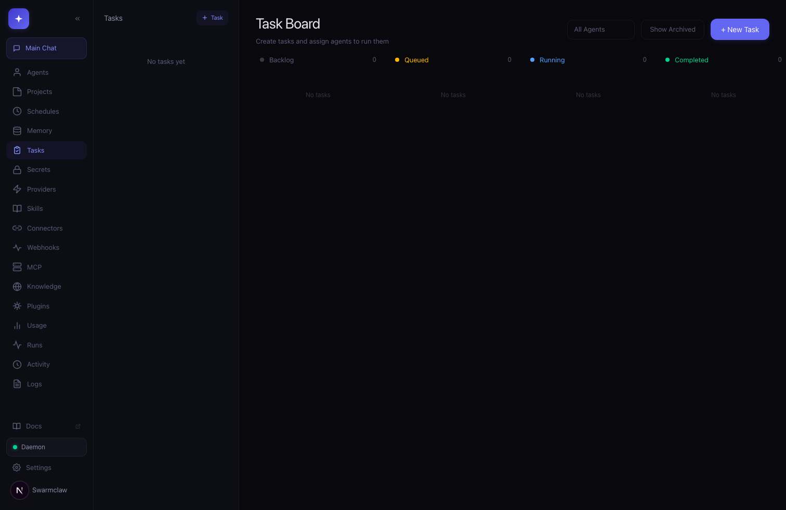

# Agent Ember

Self-hosted AI agent orchestration dashboard. Manage multiple AI providers, orchestrate agent swarms, schedule tasks, and bridge agents to chat platforms — all from a single mobile-friendly interface.

Inspired by [OpenClaw](https://github.com/openclaw).

**[Documentation](https://agent-ember.ai/docs)** | **[Website](https://agent-ember.ai)**





## Security Warning

Agent Ember can spawn **Claude Code CLI** processes with full shell access on your machine. This means agents can read, write, and execute anything your user account can. **Do not run this on a shared server or expose it to the public internet without understanding the risks.**

- Always use the access key authentication (generated on first run)
- Never expose port 3456 without a reverse proxy + TLS
- Review agent system prompts before giving them shell or browser tools

## Features

- **15 Built-in Providers** — Claude Code CLI, OpenAI Codex CLI, OpenCode CLI, Anthropic, OpenAI, Google Gemini, DeepSeek, Groq, Together AI, Mistral AI, xAI (Grok), Fireworks AI, Ollama, OpenClaw, plus custom OpenAI-compatible endpoints
- **OpenClaw Integration** — First-tier OpenClaw support with endpoint normalization (`ws://`, root HTTP, `/v1`), live health checks, and provider-level diagnostics
- **Agent Builder** — Create agents with custom personalities (soul), system prompts, tools, and skills. AI-powered generation from a description
- **Agent Tools** — Shell, process control for long-running commands, files, edit file, send file, web search, web fetch, CLI delegation (Claude/Codex/OpenCode), Playwright browser automation, and persistent memory
- **Platform Tools** — Agents can manage other agents, tasks, schedules, skills, connectors, sessions, and encrypted secrets via built-in platform tools
- **Orchestration** — Multi-agent workflows powered by LangGraph with automatic sub-agent routing
- **Agentic Execution Policy** — Tool-first autonomous action loop with progress updates, evidence-driven answers, and better use of platform tools for long-lived work
- **Task Board** — Queue and track agent tasks with status, comments, results, and archiving (soft delete with show/hide toggle)
- **Background Daemon** — Auto-processes queued tasks and scheduled jobs with a 30s heartbeat plus recurring health monitoring
- **Scheduling** — Cron-based agent scheduling with human-friendly presets
- **Loop Runtime Controls** — Switch between bounded and ongoing loops with configurable step caps, runtime guards, heartbeat cadence, and timeout budgets
- **Session Run Queue** — Per-session queued runs with followup/steer/collect modes, collect coalescing for bursty inputs, and run-state APIs
- **Voice Settings** — Per-instance ElevenLabs API key + voice ID for TTS replies, plus configurable speech recognition language for chat input
- **Chat Connectors** — Bridge agents to Discord, Slack, Telegram, and WhatsApp with media-aware inbound handling
- **Skills System** — Discover local skills, import skills from URL, and load OpenClaw `SKILL.md` files (frontmatter-compatible)
- **Execution Logging** — Structured audit trail for triggers, tool calls, file ops, commits, and errors in a dedicated `logs.db`
- **Context Management** — Auto-compaction of conversation history when approaching context limits, with manual `context_status` and `context_summarize` tools for agents
- **Memory** — Per-agent and per-session memory with hybrid FTS5 + vector embeddings search, relevance-based memory recall injected into runs, and periodic auto-journaling for durable execution context
- **Cost Tracking** — Per-message token counting and cost estimation displayed in the chat header
- **Model Failover** — Automatic key rotation on rate limits and auth errors with configurable fallback credentials
- **Plugin System** — Extend agent behavior with JS plugins (hooks: beforeAgentStart, afterAgentComplete, beforeToolExec, afterToolExec, onMessage)
- **Secrets Vault** — Encrypted storage for API keys and service tokens
- **Custom Providers** — Add any OpenAI-compatible API as a provider
- **Mobile-First UI** — Responsive glass-themed dark interface, works on phone and desktop

## Requirements

- **Node.js** 20+
- **npm** 10+
- **Claude Code CLI** (optional, for `claude-cli` provider) — [Install](https://docs.anthropic.com/en/docs/claude-code/overview)
- **OpenAI Codex CLI** (optional, for `codex-cli` provider) — [Install](https://github.com/openai/codex)
- **OpenCode CLI** (optional, for `opencode-cli` provider) — [Install](https://github.com/opencode-ai/opencode)

## Quick Start

```bash
curl -fsSL https://agent-ember.ai/install.sh | bash
```

Or manually:

```bash
git clone https://github.com/agent-emberai/agent-ember.git
cd agent-ember
npm install
npm run dev
```

On first launch, Agent Ember will:
1. Generate an **access key** and display it in the terminal
2. Save it to `.env.local`
3. Show a first-time setup screen in the browser with the key to copy

Open `http://localhost:3456` (or your machine's IP for mobile access). Enter the access key, set your name, and you're in.

## Configuration

All config lives in `.env.local` (auto-generated):

```
ACCESS_KEY=<your-access-key>       # Auth key for the dashboard
CREDENTIAL_SECRET=<auto-generated> # AES-256 encryption key for stored credentials
```

Data is stored in `data/agent-ember.db` (SQLite with WAL mode), `data/memory.db` (agent memory with FTS5 + vector embeddings), and `data/logs.db` (execution audit trail). Back the `data/` directory up if you care about your sessions, agents, and credentials. Existing JSON file data is auto-migrated to SQLite on first run.

## Architecture

```
src/
├── app/
│   ├── api/          # Next.js API routes (REST + SSE streaming)
│   └── page.tsx      # Auth flow → UserPicker → AppLayout
├── components/
│   ├── agents/       # Agent builder UI
│   ├── auth/         # Access key gate + user picker
│   ├── chat/         # Message rendering, streaming, code blocks
│   ├── connectors/   # Discord/Slack/Telegram/WhatsApp config
│   ├── layout/       # App shell, sidebar, mobile header
│   ├── providers/    # Provider management
│   ├── schedules/    # Cron scheduler
│   ├── sessions/     # Session list + new session
│   ├── skills/       # Skills manager
│   ├── tasks/        # Task board
│   └── shared/       # Reusable UI (BottomSheet, IconButton, etc.)
├── lib/
│   ├── providers/    # LLM provider implementations
│   └── server/       # Storage, orchestrator, connectors, tools
├── stores/           # Zustand state (app store, chat store)
└── types/            # TypeScript interfaces
```

**Stack:** Next.js 16, React 19, Tailwind v4, shadcn/ui, Zustand, LangGraph, TypeScript

## Providers

### CLI Providers

| Provider | Binary | Notes |
|-|-|-|
| Claude Code CLI | `claude` | Spawns with `--print --output-format stream-json`. Includes auth preflight and clearer timeout/exit diagnostics. |
| OpenAI Codex CLI | `codex` | Spawns with `--full-auto --skip-git-repo-check`. Includes login preflight and streamed CLI error events. |
| OpenCode CLI | `opencode` | Spawns with `-p` flag. Multi-model support. |

### API Providers

| Provider | Endpoint | Models |
|-|-|-|
| Anthropic | api.anthropic.com | Claude Sonnet 4.6, Opus 4.6, Haiku 4.5 |
| OpenAI | api.openai.com | GPT-4o, GPT-4.1, o3, o4-mini |
| Google Gemini | generativelanguage.googleapis.com | Gemini 2.5 Pro, Flash, Flash Lite |
| DeepSeek | api.deepseek.com | DeepSeek Chat, Reasoner |
| Groq | api.groq.com | Llama 3.3 70B, DeepSeek R1, Qwen QWQ |
| Together AI | api.together.xyz | Llama 4 Maverick, DeepSeek R1, Qwen 2.5 |
| Mistral AI | api.mistral.ai | Mistral Large, Small, Magistral, Devstral |
| xAI (Grok) | api.x.ai | Grok 3, Grok 3 Fast, Grok 3 Mini |
| Fireworks AI | api.fireworks.ai | DeepSeek R1, Llama 3.3 70B, Qwen 3 |

### Local & Remote

| Provider | Type | Notes |
|-|-|-|
| Ollama | Local/Cloud | Connects to `localhost:11434`. No API key needed. 50+ models. |
| OpenClaw | Remote Agent | Connects to a remote [OpenClaw](https://github.com/openclaw/openclaw) instance via its `/v1` API. |
| Custom | API | Any OpenAI-compatible endpoint. Add via Providers sidebar. |

### OpenClaw

[OpenClaw](https://github.com/openclaw/openclaw) is an open-source autonomous AI agent that runs on your own devices. Agent Ember has first-class OpenClaw support — add any number of remote OpenClaw instances as providers and orchestrate them all from one place.

To connect an OpenClaw instance:

1. Enable the HTTP endpoint on OpenClaw:
   ```bash
   openclaw config set gateway.http.endpoints.chatCompletions.enabled true
   launchctl kickstart -k gui/$(id -u)/ai.openclaw.gateway
   ```
2. In Agent Ember, select **OpenClaw** as the provider when creating a session or agent
3. Enter the endpoint URL (e.g. `http://192.168.1.50:18789/v1`)
4. Optionally add a Bearer token if your OpenClaw instance requires authentication

Each agent can point to a different OpenClaw instance — this is how you manage a **swarm of OpenClaws** from a single dashboard.

Agent Ember normalizes common endpoint forms automatically:
- `ws://host:18789` → `http://host:18789/v1`
- `http://host:18789` → `http://host:18789/v1`
- `http://host:18789/v1/chat/completions` → `http://host:18789/v1`

Validate connectivity/auth via the Providers UI, or call the health endpoint directly:

```bash
curl -sS \
  -H "x-access-key: ${ACCESS_KEY}" \
  "http://localhost:3456/api/providers/openclaw/health?endpoint=ws://127.0.0.1:18789&credentialId=cred_openclaw"
```

## Chat Connectors

Bridge any agent to a chat platform:

| Platform | Library | Setup |
|-|-|-|
| Discord | discord.js | Bot token + channel IDs |
| Slack | @slack/bolt | Bot token + app token (Socket Mode) |
| Telegram | grammy | Bot token from @BotFather |
| WhatsApp | baileys | QR code pairing (shown in browser) |

Connector sessions preserve attachment visibility in chat context:
- WhatsApp media is decoded and persisted to `/api/uploads/...` when possible
- Telegram and Slack attachments are downloaded to uploads when possible
- Discord attachments are captured as media metadata/URLs

Agents automatically suppress replies to simple acknowledgments ("ok", "thanks", thumbs-up, etc.) via a `NO_MESSAGE` response — conversations feel natural without a forced reply to every message. This is handled at the connector layer, so agents can return `NO_MESSAGE` as their response content and the platform won't deliver anything to the channel.

For proactive outreach, `connector_message_tool` supports text plus optional `imageUrl` / `fileUrl` / `mediaPath` (local file path) payloads. All four platforms (WhatsApp, Discord, Slack, Telegram) support local file sending via `mediaPath` with auto-detected MIME types.

## Agent Tools

Agents can use the following tools when enabled:

| Tool | Description |
|-|-|
| Shell | Execute commands in the session working directory |
| Process | Control long-running shell commands (`process_tool`) |
| Files | Read, write, list, and send files |
| Copy/Move/Delete File | Optional file ops (`copy_file`, `move_file`, `delete_file`) configurable per agent/session (`delete_file` is off by default) |
| Edit File | Search-and-replace editing (exact match required) |
| Web Search | Search the web via DuckDuckGo HTML scraping |
| Web Fetch | Fetch and extract text content from URLs (uses cheerio) |
| CLI Delegation | Delegate complex tasks to Claude Code, Codex CLI, or OpenCode CLI |
| Browser | Playwright-powered web browsing via MCP (navigate, click, type, screenshot, PDF) |
| Memory | Store and retrieve long-term memories with FTS5 + vector search, file references, image attachments, and linked memory graph traversal |

### Platform Tools

Agents with platform tools enabled can manage the Agent Ember instance:

| Tool | Description |
|-|-|
| Manage Agents | List, create, update, delete agents |
| Manage Tasks | Create and manage task board items with agent assignment |
| Manage Schedules | Create cron, interval, or one-time scheduled jobs |
| Manage Skills | List, create, update reusable skill definitions |
| Manage Documents | Upload/search/get/delete indexed docs for lightweight RAG workflows |
| Manage Webhooks | Register external webhook endpoints that trigger agent sessions |
| Manage Connectors | Manage chat platform bridges |
| Manage Sessions | Enable `sessions_tool` for list/history/status/send/spawn/stop, plus `context_status` and `context_summarize` for context window management |
| Manage Secrets | Store and retrieve encrypted reusable secrets |

Enable tools per-session or per-agent in the UI. CLI providers (Claude Code, Codex, OpenCode) handle tools natively through their own CLI.
OpenClaw provider capabilities are also managed remotely in OpenClaw itself, so local Tools/Platform toggles are hidden for OpenClaw agents.

## Starter Skills (URL Import)

Import these directly in **Skills → Import via URL**:

- `https://agent-ember.ai/skills/openclaw-agent-ember-bridge/SKILL.md`
- `https://agent-ember.ai/skills/agent-ember-bootstrap/SKILL.md`

## Cost Tracking

Token usage and estimated costs are tracked per message for API-based providers (Anthropic, OpenAI). After each response, a badge in the chat header shows token count and estimated cost.

- **API endpoint:** `GET /api/usage` — returns usage summary by session and provider
- **Data:** Stored in `data/agent-ember.db` (usage table)
- Cost estimates use published model pricing (updated manually in `src/lib/server/cost.ts`)

## Background Daemon

The daemon auto-processes queued tasks from the scheduler on a 30-second interval. It also runs recurring health checks that detect stale heartbeat sessions and can send proactive WhatsApp alerts when issues are detected. Toggle the daemon from the sidebar indicator or via API.

- **API:** `GET /api/daemon` (status), `POST /api/daemon` with `{"action": "start"}` or `{"action": "stop"}`
- Auto-starts on boot if queued tasks are found

## Main Agent Loop

For autonomous long-running missions, enable the **Main Loop** on a session. This lets an agent pursue a goal continuously with heartbeat-driven progress checks and automatic followups.

- **Heartbeat prompts:** `SWARM_MAIN_MISSION_TICK` triggers on each heartbeat, giving the agent its goal, status, and pending events
- **Auto-followup:** When an agent returns `[MAIN_LOOP_META] {"follow_up":true}`, the loop schedules another tick after `delay_sec`
- **Mission state:** Tracks `goal`, `status` (idle/progress/blocked/ok), `summary`, `nextAction`, `autonomyMode` (assist/autonomous), and pending events
- **Autonomy modes:**
  - `autonomous`: Agent executes safe actions without confirmation, only asks when blocked by permissions/credentials
  - `assist`: Agent asks before irreversible external actions (sending messages, purchases, account mutations)
- **API:** `POST /api/sessions/[id]/main-loop` with `{"tick":true}` to trigger a mission tick
- **CLI:** `agent-ember sessions main-loop --session-id <id>` (via daemon schedule)

Use this for background agents that should "keep working" on a goal until blocked or complete.

## Loop Modes

Configure loop behavior in **Settings → Runtime & Loop Controls**:

- **Bounded**: fixed max steps for agent and orchestrator loops (default behavior)
- **Ongoing**: loops keep iterating until they hit your safety cap and optional runtime limit

You can also tune shell timeout, Claude Code delegation timeout, and CLI provider process timeout from the same settings panel.

## CLI Troubleshooting

- **Claude delegate returns no output or fails quickly:** verify Claude auth on the host with:
  - `claude auth status`
  - If not logged in: `claude auth login` (or `claude setup-token`)
- **Claude delegate times out:** increase **Claude Code Timeout (sec)** in Settings.
- **Codex fails outside a git repo:** Agent Ember now uses `--skip-git-repo-check`, but if login is missing run:
  - `codex login`
  - `codex login status`
- **CLI provider errors are now surfaced in chat:** non-zero exits and streamed error events are emitted as chat errors instead of failing silently.

## Voice & Heartbeat

Configure these in **Settings**:

- **Voice** — set `ElevenLabs API Key`, `ElevenLabs Voice ID`, and `Speech Recognition Language`
- **Heartbeat** — set `Heartbeat Interval (Seconds)` and `Heartbeat Prompt` for ongoing session pings

Heartbeat pings are internal checks for ongoing sessions. If there's no new status, the assistant returns `HEARTBEAT_OK`; otherwise it returns a concise progress update and next step. In chat UI, heartbeat entries render as compact expandable cards and consecutive heartbeat streaks are collapsed to the latest item.

## Embeddings & Hybrid Memory Search

Enable semantic search for agent memory by configuring an embedding provider in Settings:

- **Local (Free)** — runs `all-MiniLM-L6-v2` directly in Node.js via HuggingFace Transformers. No API key, no cost, works offline. Model downloads once (~23MB).
- **OpenAI** — uses `text-embedding-3-small` (requires API key)
- **Ollama** — uses local models like `nomic-embed-text`

When enabled, new memories get vector embeddings. Search uses both FTS5 keyword matching and cosine similarity, merging results for better recall.

## Model Failover

Agents and sessions can have **fallback credentials**. If the primary API key gets a 401, 429, or 500 error, Agent Ember automatically retries with the next credential. Configure fallback keys in the agent builder UI.

## Plugins

Extend agent behavior with JS plugins. Three ways to install:

1. **Marketplace** — Browse and install approved plugins from Settings → Plugins → Marketplace
2. **URL** — Install from any HTTPS URL via Settings → Plugins → Install from URL
3. **Manual** — Drop `.js` files into `data/plugins/`

### Plugin Format (Agent Ember)

```js
module.exports = {
  name: 'my-plugin',
  description: 'What it does',
  hooks: {
    beforeAgentStart: async ({ session, message }) => { /* ... */ },
    afterAgentComplete: async ({ session, response }) => { /* ... */ },
    beforeToolExec: async ({ toolName, input }) => { /* ... */ },
    afterToolExec: async ({ toolName, input, output }) => { /* ... */ },
    onMessage: async ({ session, message }) => { /* ... */ },
  },
}
```

### OpenClaw Plugin Compatibility

Agent Ember natively supports the OpenClaw plugin format. Drop an OpenClaw plugin into `data/plugins/` and it works automatically — lifecycle hooks are mapped:

| OpenClaw Hook | Agent Ember Hook |
|-|-|
| `onAgentStart` | `beforeAgentStart` |
| `onAgentComplete` | `afterAgentComplete` |
| `onToolCall` | `beforeToolExec` |
| `onToolResult` | `afterToolExec` |
| `onMessage` | `onMessage` |

Plugin API: `GET /api/plugins`, `POST /api/plugins`, `GET /api/plugins/marketplace`, `POST /api/plugins/install`.

## Deploy to a VPS

### Direct (pm2 + Caddy)

```bash
# On your VPS
git clone https://github.com/agent-emberai/agent-ember.git
cd agent-ember
npm install
npm run build

# Run with pm2
sudo npm install -g pm2
pm2 start npm --name agent-ember -- start
pm2 save && pm2 startup
```

Point a reverse proxy (Caddy or nginx) at `localhost:3456` for TLS. See the [full deployment guide](https://agent-ember.ai/docs/deployment).

### Docker

```bash
git clone https://github.com/agent-emberai/agent-ember.git
cd agent-ember
docker compose up -d
```

Data is persisted in `data/` and `.env.local` via volume mounts. Updates: `git pull && docker compose up -d --build`.

### Updating

Agent Ember has a built-in update checker — a banner appears in the sidebar when new commits are available, with a one-click update button. Your data in `data/` and `.env.local` is never touched by updates.

## Development

```bash
npm run dev          # Dev server on 0.0.0.0:3456
npm run dev:webpack  # Fallback to webpack dev server (if Turbopack crashes)
npm run dev:clean    # Clear .next cache then restart dev server
npm run build        # Production build
npm run build:ci     # CI build (skips ESLint; lint baseline runs separately)
npm run start        # Start production server
npm run start:standalone # Start standalone server after build
npm run lint         # ESLint
npm run lint:baseline # Fail only on net-new lint issues vs .eslint-baseline.json
npm run lint:baseline:update # Refresh lint baseline intentionally
```

The dev server binds to `0.0.0.0` so you can access it from your phone on the same network.

### Turbopack Panic Recovery

If you see a Turbopack panic like `Failed to lookup task type` or missing `.sst/.meta` files:

```bash
rm -rf .next
npm run dev:clean
```

If it still reproduces, use webpack mode:

```bash
npm run dev:webpack
```

## CLI

Agent Ember ships a built-in CLI for core operational workflows:

```bash
# show command help
npm run cli -- --help

# or run the executable directly
node ./bin/agent-ember.js --help
```

### Usage

```bash
agent-ember [global-options] <group> <command> [command-options]
```

### Global Options

| Flag | Description |
|-|-|
| `-u, --url <url>` | Agent Ember base URL (default: `http://localhost:3456`) |
| `-k, --key <key>` | Access key (or set `SWARMCLAW_ACCESS_KEY`) |
| `--raw` | Print compact JSON output |

### Command Groups (9 groups)

| Group | Commands |
|-|-|
| `agents` | `list`, `get` |
| `connectors` | `list`, `get`, `create`, `update`, `delete`, `start`, `stop`, `repair` |
| `memory` | `store`, `search`, `get` |
| `memory-images` | `get` |
| `runs` | `list`, `get` |
| `schedules` | `list`, `get`, `create` |
| `sessions` | `list`, `get`, `create`, `update`, `delete`, `history`, `stop` |
| `tasks` | `list`, `get`, `create`, `update`, `delete`, `archive` |
| `webhooks` | `list`, `get`, `create`, `update`, `delete`, `trigger` |

### Examples

```bash
# list agents
agent-ember agents list

# get agent details
agent-ember agents get <agentId>

# create a task
agent-ember tasks create --title "Fix flaky CI test" --description "Stabilize retry logic" --agent-id <agentId>

# create an interval schedule
agent-ember schedules create --name "Health Check" --agent-id <agentId> --task-prompt "Run diagnostics" --schedule-type interval --interval-ms 60000

# session history
agent-ember sessions history <sessionId>

# create a session
agent-ember sessions create --name "Ops Assistant" --agent-id <agentId> --provider anthropic

# store and search memory
agent-ember memory store --title "Deploy note" --content "Use canary first" --category note --agent-id <agentId>
agent-ember memory search -q "canary"

# create and list webhooks
agent-ember webhooks create --name "GitHub Push" --source "github" --agent-id <agentId> --event push --secret "webhook-secret"
agent-ember webhooks list

# trigger a webhook manually
agent-ember webhooks trigger <webhookId> --event push --payload '{"repository":"agent-ember"}'

# create/start connector runtime
agent-ember connectors create --platform discord --agent-id <agentId> --name "Discord Bridge"
agent-ember connectors start <connectorId>
```

## Credits

- Inspired by [OpenClaw](https://github.com/openclaw)

## License

MIT
