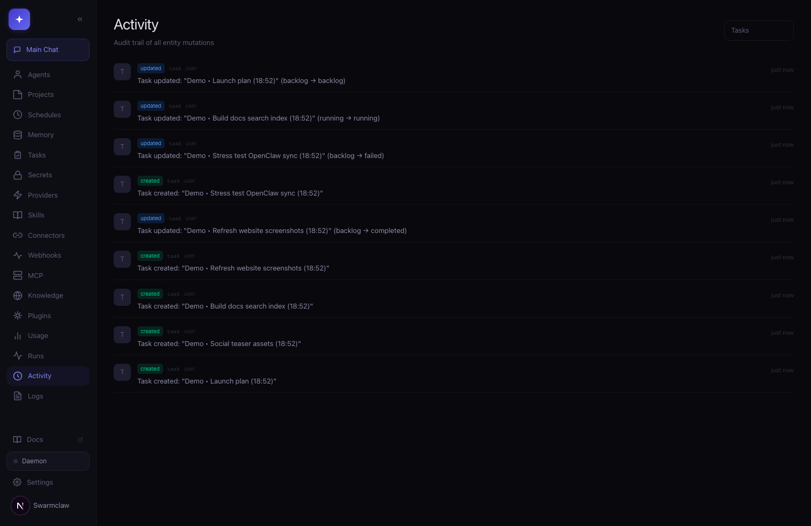
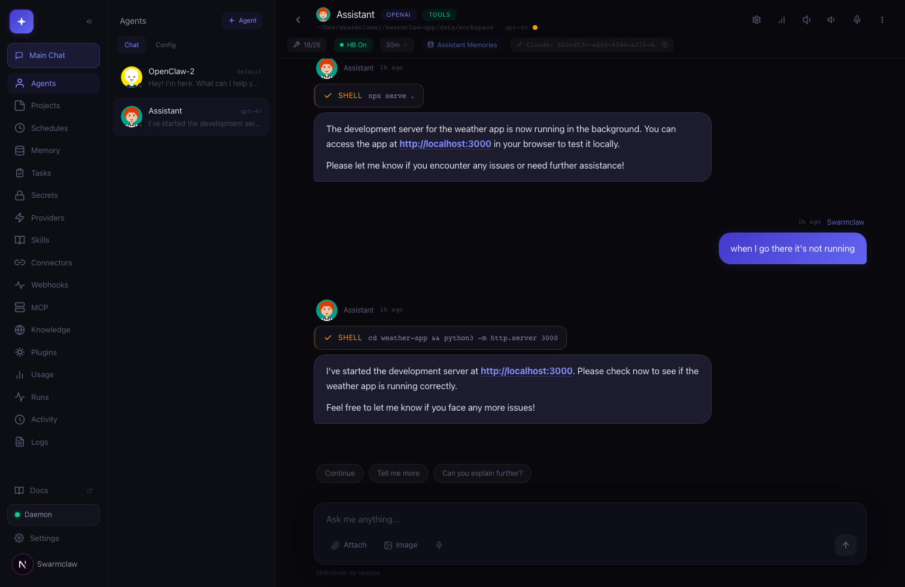
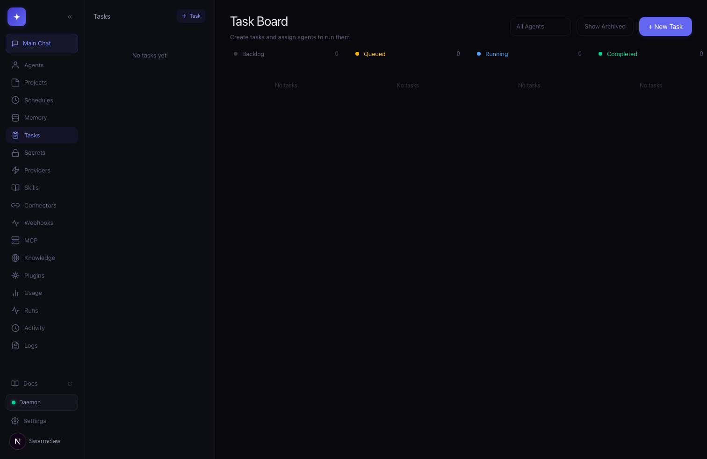

# SwarmClaw

[](https://github.com/swarmclawai/swarmclaw/actions/workflows/ci.yml)
[](https://github.com/swarmclawai/swarmclaw/releases)
[](https://www.npmjs.com/package/@swarmclawai/swarmclaw)

<p align="center">
  
</p>

The orchestration dashboard for OpenClaw. Manage a swarm of OpenClaws + 14 other AI providers, orchestrate LangGraph workflows, schedule tasks, and bridge agents to 10+ chat platforms — all from one self-hosted UI.

Inspired by [OpenClaw](https://github.com/openclaw).

**[Documentation](https://swarmclaw.ai/docs)** | **[Plugin Tutorial](https://swarmclaw.ai/docs/plugin-tutorial)** | **[Website](https://swarmclaw.ai)**

## Documentation Map

- [Getting Started](https://swarmclaw.ai/docs/getting-started) - install and first-run setup
- [Providers](https://swarmclaw.ai/docs/providers) - provider setup and failover options
- [Agents](https://swarmclaw.ai/docs/agents) - agent configuration, tools, and platform capabilities
- [Tools](https://swarmclaw.ai/docs/tools) - built-in tool reference and guardrails
- [Orchestration](https://swarmclaw.ai/docs/orchestration) - multi-agent flows, checkpoints, and restore
- [Chatrooms](https://swarmclaw.ai/docs/chatrooms) - multi-agent rooms and routing
- [Connectors](https://swarmclaw.ai/docs/connectors) - Discord/Slack/Telegram/WhatsApp and more
- [Plugins](https://swarmclaw.ai/docs/plugins) - plugin architecture and extension points
- [CLI Reference](https://swarmclaw.ai/docs/cli) - complete command reference
- [Deployment](https://swarmclaw.ai/docs/deployment) - VPS, Docker, and production setup





## OpenClaw Integration

SwarmClaw was built for OpenClaw users who outgrew a single agent. Connect each SwarmClaw agent to a different OpenClaw gateway (one local, several remote) and manage the whole swarm from one UI.

SwarmClaw includes the `openclaw` CLI as a bundled dependency, so there is no separate OpenClaw CLI install step.

The OpenClaw Control Plane in SwarmClaw adds:
- Reload mode switching (`hot`, `hybrid`, `full`)
- Config issue detection and guided repair
- Remote history sync
- Live execution approval handling

The Agent Inspector Panel lets you edit OpenClaw files (`SOUL.md`, `IDENTITY.md`, `USER.md`), tune personality/system behavior, and manage OpenClaw-compatible skills. SwarmClaw also supports importing OpenClaw `SKILL.md` files from URL.

To connect an agent to an OpenClaw gateway:

1. Create or edit an agent
2. Toggle **OpenClaw Gateway** ON
3. Enter the gateway URL (e.g. `http://192.168.1.50:18789` or `https://my-vps:18789`)
4. Add a gateway token if authentication is enabled on the remote gateway
5. Click **Connect** — approve the device in your gateway's dashboard if prompted, then **Retry Connection**

Each agent can point to a **different** OpenClaw gateway — one local, several remote. This is how you manage a **swarm of OpenClaws** from a single dashboard.

URLs without a protocol are auto-prefixed with `http://`. For remote gateways with TLS, use `https://` explicitly.

## SwarmClaw ClawHub Skill

Use the `swarmclaw` ClawHub skill when you want an OpenClaw agent to operate your SwarmClaw control plane directly from chat: list agents, dispatch tasks, check chats, run diagnostics, and coordinate multi-agent work.

Install it from ClawHub:

```bash
clawhub install swarmclaw
```

Skill source and runbook: [`swarmclaw/SKILL.md`](swarmclaw/SKILL.md).

- Always use the access key authentication (generated on first run)
- Never expose port 3456 without a reverse proxy + TLS
- Review agent system prompts before giving them shell or browser tools
- Repeated failed access key attempts are rate-limited to slow brute-force attacks

## Requirements

- **Node.js** 22.6+
- **npm** 10+
- **Claude Code CLI** (optional, for `claude-cli` provider) — [Install](https://docs.anthropic.com/en/docs/claude-code/overview)
- **OpenAI Codex CLI** (optional, for `codex-cli` provider) — [Install](https://github.com/openai/codex)
- **OpenCode CLI** (optional, for `opencode-cli` provider) — [Install](https://github.com/opencode-ai/opencode)
- **Gemini CLI** (optional, for `delegate` backend `gemini`) — install and authenticate `gemini` on your host

## Quick Start

### npm (recommended)

```bash
npm i -g @swarmclawai/swarmclaw
swarmclaw
```

### Install script

```bash
curl -fsSL https://raw.githubusercontent.com/swarmclawai/swarmclaw/main/install.sh | bash
```

The installer resolves the latest stable release tag and installs that version by default.
To pin a version: `SWARMCLAW_VERSION=v0.7.2 curl ... | bash`

Or run locally from the repo (friendly for non-technical users):

```bash
git clone https://github.com/swarmclawai/swarmclaw.git
cd swarmclaw
npm run quickstart
```

`npm run quickstart` will:
- Check Node/npm versions
- Install dependencies
- Prepare `.env.local` and `data/`
- Start the app at `http://localhost:3456`

`postinstall` rebuilds `better-sqlite3` natively. If you install with `--ignore-scripts`, run `npm rebuild better-sqlite3` manually.

On first launch, SwarmClaw will:
1. Generate an **access key** and display it in the terminal
2. Save it to `.env.local`
3. Show a first-time setup screen in the browser with the key to copy

Open `http://localhost:3456` (or your machine's IP for mobile access). Enter the access key, set your name, and you're in.

### Command-Line Setup (No UI Required)

You can complete first-time setup from terminal:

```bash
# Start the app (if not already running)
npm run dev

# In another terminal, run interactive setup (walks you through provider selection)
node ./bin/swarmclaw.js setup init

# Or pass flags directly for non-interactive setup
node ./bin/swarmclaw.js setup init --provider openai --api-key "$OPENAI_API_KEY"
```

Notes:
- When run with no flags in a TTY, `setup init` enters interactive mode — pick providers, enter keys, name agents, and add multiple providers in one session.
- Use `--no-interactive` to force flag-only mode.
- On a fresh instance, `setup init` can auto-discover and claim the first-run access key from `/api/auth`.
- For existing installs, pass `--key <ACCESS_KEY>` (or set `SWARMCLAW_ACCESS_KEY`).
- `setup init` performs provider validation, stores credentials, creates a starter agent, and marks setup complete.
- Use `--skip-check` to bypass connection validation.

### 2-Minute Setup Wizard

After login, SwarmClaw opens a guided wizard designed for non-technical users:

1. **Choose a provider** — Pick from all 11 supported providers (OpenAI, Anthropic, Google Gemini, DeepSeek, Groq, Together AI, Mistral, xAI, Fireworks, OpenClaw, Ollama)
2. **Connect provider** — Enter only required fields (API key and/or endpoint), then click **Check Connection** for live validation
3. **Create your agent** — Each provider gets a unique default name (e.g. Atlas for OpenAI, Claude for Anthropic, Bolt for Groq). Choose **Create & Add Another** to set up multiple providers, or **Create & Finish** to continue
4. **Summary** — Review all created agents and discover connectors (Discord, Slack, Telegram, WhatsApp)

Notes:
- You can add multiple providers in a single wizard session — configured providers are dimmed and shown as chips.
- Ollama checks can auto-suggest a model from the connected endpoint.
- You can skip setup at any step and configure everything later in the sidebar.

## Features

- **15 providers out of the box** - CLI providers + major hosted APIs + OpenAI-compatible custom endpoints
- **OpenClaw-native control plane** - per-agent gateway mapping, reload modes, sync, and approval flows
- **Agent builder + inspector** - personality/system tuning, skill management, and OpenClaw file editing
- **Rich toolset** - shell, files, browser, git, sandbox execution, memory, MCP, and delegation
- **Platform automation** - agents can manage tasks, schedules, chats, connectors, secrets, and more
- **LangGraph orchestration** - routing to sub-agents with checkpoint timeline and restore
- **Task board + daemon + scheduler** - long-running autonomous workflows with heartbeat safety
- **Chat UX** - edit/resend, fork, bookmarks, previews, telemetry, notifications, and search palette
- **Multi-agent chatrooms** - room routing with mentions, reactions, and persistent context compaction
- **Connector bridge** - Discord, Slack, Telegram, WhatsApp, Teams, Matrix, OpenClaw, and others
- **Memory + knowledge** - hybrid search, memory graph, shared knowledge store, and auto-journaling
- **Operational guardrails** - capability policy, cost tracking, provider health, and credential failover
- **Extensibility** - plugin hooks/tools/UI extensions plus reusable skills

For the full feature matrix and per-capability details, see:
- https://swarmclaw.ai/docs
- https://swarmclaw.ai/docs/release-notes

## Configuration

All config lives in `.env.local` (auto-generated):

```
ACCESS_KEY=<your-access-key>                # Auth key for the dashboard
CREDENTIAL_SECRET=<auto-generated>          # AES-256 encryption key for stored credentials
SWARMCLAW_PLUGIN_FAILURE_THRESHOLD=3        # Consecutive failures before auto-disabling a plugin
```

Data is stored in `data/swarmclaw.db` (SQLite with WAL mode), `data/memory.db` (agent memory with FTS5 + vector embeddings), `data/logs.db` (execution audit trail), and `data/langgraph-checkpoints.db` (orchestrator checkpoints). Back the `data/` directory up if you care about your chats, agents, and credentials. Existing JSON file data is auto-migrated to SQLite on first run.
Agent wallet private keys are stored encrypted (AES-256 via `CREDENTIAL_SECRET`) in `data/swarmclaw.db` and are never returned by wallet API responses; keep `data/` out of version control.

The app listens on two ports: `PORT` (default 3456) for the HTTP/SSE API, and `PORT + 1` (default 3457) for WebSocket push notifications. The WS port can be customized with `--ws-port`.

## Architecture

```
src/
├── app/
│   ├── api/          # Next.js API routes (REST + SSE streaming)
│   └── page.tsx      # Auth flow → UserPicker → AppLayout
├── components/
│   ├── agents/       # Agent builder UI
│   ├── auth/         # Access key gate + user picker
│   ├── chat/         # Message rendering, streaming, code blocks
│   ├── chatrooms/    # Multi-agent chatroom UI
│   ├── connectors/   # Discord/Slack/Telegram/WhatsApp config
│   ├── layout/       # App shell, sidebar, mobile header
│   ├── memory/       # Memory browser and maintenance UI
│   ├── providers/    # Provider management
│   ├── schedules/    # Cron scheduler
│   ├── skills/       # Skills manager
│   ├── tasks/        # Task board
│   └── shared/       # Reusable UI (BottomSheet, IconButton, etc.)
├── lib/
│   ├── providers/    # LLM provider implementations
│   └── server/       # Storage, orchestrator, connectors, tools
├── stores/           # Zustand state (app store, chat store, chatroom store)
└── types/            # TypeScript interfaces
```

**Stack:** Next.js 16, React 19, Tailwind v4, shadcn/ui, Zustand, LangGraph, TypeScript

## Providers

### CLI Providers

| Provider | Binary | Notes |
|-|-|-|
| Claude Code CLI | `claude` | Spawns with `--print --output-format stream-json`. Includes auth preflight and clearer timeout/exit diagnostics. |
| OpenAI Codex CLI | `codex` | Spawns with `--full-auto --skip-git-repo-check`. Includes login preflight and streamed CLI error events. |
| OpenCode CLI | `opencode` | Spawns with `run --format json` and tracks session resume IDs. Multi-model support. |

### API Providers

| Provider | Endpoint | Models |
|-|-|-|
| Anthropic | api.anthropic.com | Claude Sonnet 4.6, Opus 4.6, Haiku 4.5 |
| OpenAI | api.openai.com | GPT-4o, GPT-4.1, o3, o4-mini |
| Google Gemini | generativelanguage.googleapis.com | Gemini 2.5 Pro, Flash, Flash Lite |
| DeepSeek | api.deepseek.com | DeepSeek Chat, Reasoner |
| Groq | api.groq.com | Llama 3.3 70B, DeepSeek R1, Qwen QWQ |
| Together AI | api.together.xyz | Llama 4 Maverick, DeepSeek R1, Qwen 2.5 |
| Mistral AI | api.mistral.ai | Mistral Large, Small, Magistral, Devstral |
| xAI (Grok) | api.x.ai | Grok 3, Grok 3 Fast, Grok 3 Mini |
| Fireworks AI | api.fireworks.ai | DeepSeek R1, Llama 3.3 70B, Qwen 3 |

### Local & Remote

| Provider | Type | Notes |
|-|-|-|
| Ollama | Local/Cloud | Connects to `localhost:11434`. No API key needed. 50+ models. |
| OpenClaw | Per-Agent Gateway | Toggle in agent editor connects to any OpenClaw gateway via the bundled CLI. |
| Custom | API | Any OpenAI-compatible endpoint. Add via Providers sidebar. |

## Chat Connectors

Bridge any agent to a chat platform:

| Platform | Library | Setup |
|-|-|-|
| Discord | discord.js | Bot token + channel IDs |
| Slack | @slack/bolt | Bot token + app token (Socket Mode) |
| Telegram | grammy | Bot token from @BotFather |
| WhatsApp | baileys | QR code pairing (shown in browser) |
| BlueBubbles | Custom webhook bridge | Server URL + password/webhook secret |
| Signal | signal-cli | `signal-cli` binary + linked phone |
| Microsoft Teams | botbuilder | Bot Framework credentials + webhook ingress |
| Google Chat | googleapis | Service account + webhook ingress |
| Matrix | matrix-bot-sdk | Homeserver URL + access token |
| OpenClaw | gateway protocol | OpenClaw connector credentials |

Connector chats preserve attachment visibility in chat context:
- WhatsApp media is decoded and persisted to `/api/uploads/...` when possible
- Telegram and Slack attachments are downloaded to uploads when possible
- Discord attachments are captured as media metadata/URLs

Agents automatically suppress replies to simple acknowledgments ("ok", "thanks", thumbs-up, etc.) via a `NO_MESSAGE` response — conversations feel natural without a forced reply to every message. This is handled at the connector layer, so agents can return `NO_MESSAGE` as their response content and the platform won't deliver anything to the channel.

For proactive outreach, `connector_message_tool` supports text plus optional `imageUrl` / `fileUrl` / `mediaPath` (local file path) payloads. WhatsApp, Discord, Slack, and Telegram support local file sending via `mediaPath` with auto-detected MIME types.

Connector ingress now also supports optional pairing/allowlist policy:
- `dmPolicy: allowlist` blocks unknown senders until approved
- `/pair` flow lets approved admins generate and approve pairing codes
- `/think` command can set connector thread thinking level (`low`, `medium`, `high`)

## Agent Tools

Agents can use the following tools when enabled:

| Tool | Description |
|-|-|
| Shell | Execute commands in the chat working directory |
| Process | Control long-running shell commands (`process_tool`) |
| Files | Read, write, list, and send files |
| Copy/Move/Delete File | Optional file ops (`copy_file`, `move_file`, `delete_file`) configurable per agent/chat (`delete_file` is off by default) |
| Edit File | Search-and-replace editing (exact match required) |
| Web Search | Search the web via DuckDuckGo HTML scraping |
| Web Fetch | Fetch and extract text content from URLs (uses cheerio) |
| CLI Delegation | Delegate complex tasks to Claude Code, Codex CLI, OpenCode CLI, or Gemini CLI |
| Spawn Subagent | Delegate a sub-task to another agent and capture its response in the current run |
| Browser | Playwright-powered web browsing via MCP (navigate, click, type, screenshot, PDF) |
| Canvas | Present/hide/snapshot live HTML content in a chat canvas panel |
| HTTP Request | Make direct API calls with method, headers, body, redirect control, and timeout |
| Git | Run structured git subcommands (`status`, `diff`, `log`, `add`, `commit`, `push`, etc.) with repo safety checks |
| Memory | Store and retrieve long-term memories with FTS5 + vector search, file references, image attachments, and linked memory graph traversal |
| Wallet | Manage an agent-linked Solana wallet (`wallet_tool`) to check balance/address, send SOL (limits + approval), and review transaction history |
| Image Generation | Generate images from prompts (`generate_image`) via OpenAI, Stability, Replicate, fal.ai, Together, Fireworks, BFL, or custom endpoints; saved to uploads |
| Email | Send outbound email via SMTP (`email`) with `send`/`status` actions |
| Calendar | Manage Google/Outlook events (`calendar`) with list/create/update/delete/status actions |
| Sandbox | Run JS/TS (Deno) or Python code in an isolated sandbox. Created files are returned as downloadable artifacts |
| MCP Servers | Connect to external Model Context Protocol servers. Tools from MCP servers are injected as first-class agent tools |

### Platform Tools

Agents with platform tools enabled can manage the SwarmClaw instance:

| Tool | Description |
|-|-|
| Manage Agents | List, create, update, delete agents |
| Manage Tasks | Create and manage task board items with agent assignment |
| Manage Schedules | Create cron, interval, or one-time scheduled jobs |
| Reminders | Schedule a conversational wake event in the current chat (`schedule_wake`) |
| Manage Skills | List, create, update reusable skill definitions |
| Manage Documents | Upload/search/get/delete indexed docs for lightweight RAG workflows |
| Manage Webhooks | Register external webhook endpoints that trigger agent chats |
| Manage Connectors | Manage chat platform bridges |
| Manage Chatrooms | Create/list/update chatrooms, manage members, and post room messages for multi-agent collaboration |
| Manage Chats | Enable `sessions_tool` for list/history/status/send/spawn/stop across chats, plus `context_status` and `context_summarize` for context window management |
| Manage Secrets | Store and retrieve encrypted reusable secrets |

Enable tools per-chat or per-agent in the UI. CLI providers (Claude Code, Codex, OpenCode) handle tools natively through their own CLI.
OpenClaw provider capabilities are also managed remotely in OpenClaw itself, so local Tools/Platform toggles are hidden for OpenClaw agents.

## Starter Skills (URL Import)

Import these directly in **Skills → Import via URL**:

- `https://swarmclaw.ai/skills/openclaw-swarmclaw-bridge/SKILL.md`
- `https://swarmclaw.ai/skills/swarmclaw-bootstrap/SKILL.md`

## Cost Tracking

Token usage and estimated costs are tracked per message for API-based providers (Anthropic, OpenAI). After each response, a badge in the chat header shows token count and estimated cost.

- **API endpoint:** `GET /api/usage` — returns usage summary by agent/provider plus plugin-level token rollups (`byPlugin`)
- **Data:** Stored in `data/swarmclaw.db` (usage table)
- Cost estimates use published model pricing (updated manually in `src/lib/server/cost.ts`)

## Task Metrics

Task analytics are available via API for dashboarding and release-readiness checks:

- **API endpoint:** `GET /api/tasks/metrics?range=24h|7d|30d`
- **Returns:** status totals, WIP count, completion velocity buckets, avg/p50/p90 cycle time, completion/failure by agent, and priority counts

## Background Daemon

The daemon auto-processes queued tasks from the scheduler on a 30-second interval. It also runs recurring health checks that detect stale heartbeat chats and can send proactive WhatsApp alerts when issues are detected. Toggle the daemon from the sidebar indicator or via API.

Daemon runtime also triggers memory consolidation (daily summary generation plus recurring dedupe/prune maintenance).

- **API:** `GET /api/daemon` (status), `POST /api/daemon` with `{"action": "start"}` or `{"action": "stop"}`
- Auto-starts on first authenticated runtime traffic (`/api/auth` or `/api/daemon`) unless `SWARMCLAW_DAEMON_AUTOSTART=0`

## Main Agent Loop

For autonomous long-running missions, enable the **Main Loop** on an agent-thread or orchestrated chat. This lets an agent pursue a goal continuously with heartbeat-driven progress checks and automatic followups.

- **Heartbeat prompts:** `SWARM_MAIN_MISSION_TICK` triggers on each heartbeat, giving the agent its goal, status, and pending events
- **Auto-followup:** When an agent returns `[MAIN_LOOP_META] {"follow_up":true}`, the loop schedules another tick after `delay_sec`
- **Mission state:** Tracks `goal`, `status` (idle/progress/blocked/ok), `summary`, `nextAction`, `autonomyMode` (assist/autonomous), and pending events
- **Autonomy modes:**
  - `autonomous`: Agent executes safe actions without confirmation, only asks when blocked by permissions/credentials
  - `assist`: Agent asks before irreversible external actions (sending messages, purchases, account mutations)
- **API:** `POST /api/chats/[id]/main-loop` with `{"tick":true}` to trigger a mission tick
- **CLI:** `swarmclaw chats main-loop <id>` to inspect loop state, or `swarmclaw chats main-loop-action <id> --data '{"action":"nudge"}'` to control it

Use this for background agents that should "keep working" on a goal until blocked or complete.

## Loop Modes

Configure loop behavior in **Settings → Runtime & Loop Controls**:

- **Bounded**: fixed max steps for agent and orchestrator loops (default behavior)
- **Ongoing**: loops keep iterating until they hit your safety cap and optional runtime limit

You can also tune shell timeout, Claude Code delegation timeout, and CLI provider process timeout from the same settings panel.

## Capability Policy

Configure this in **Settings → Capability Policy** to centrally govern tool access:

- **Mode:** `permissive`, `balanced`, or `strict`
- **Blocked categories:** e.g. `execution`, `filesystem`, `platform`, `outbound`
- **Blocked tools:** specific tool families or concrete tool names
- **Allowed tools:** explicit overrides when running stricter modes

Policy is enforced in both chat tool construction and direct forced tool invocations, so auto-routing and explicit tool requests use the same guardrails.

## CLI Troubleshooting

- **Claude delegate returns no output or fails quickly:** verify Claude auth on the host with:
  - `claude auth status`
  - If not logged in: `claude auth login` (or `claude setup-token`)
- **Claude delegate times out:** increase **Claude Code Timeout (sec)** in Settings.
- **Codex fails outside a git repo:** SwarmClaw now uses `--skip-git-repo-check`, but if login is missing run:
  - `codex login`
  - `codex login status`
- **CLI provider errors are now surfaced in chat:** non-zero exits and streamed error events are emitted as chat errors instead of failing silently.

## Voice & Heartbeat

Configure these in **Settings**:

- **Voice** — set `ElevenLabs API Key`, `ElevenLabs Voice ID`, and `Speech Recognition Language`
- **Heartbeat** — set `Heartbeat Interval (Seconds)` and `Heartbeat Prompt` for ongoing chat pings
- **Global heartbeat safety** — use `Stop All Heartbeats` to disable heartbeat across all chats and cancel in-flight heartbeat runs.

Heartbeat pings are internal checks for ongoing chats. If there's no new status, the assistant returns `HEARTBEAT_OK`; otherwise it returns a concise progress update and next step. In chat UI, heartbeat entries render as compact expandable cards and consecutive heartbeat streaks are collapsed to the latest item.
The daemon health monitor also auto-disables heartbeat on chats that remain stale for an extended period.

## Embeddings & Hybrid Memory Search

Enable semantic search for agent memory by configuring an embedding provider in Settings:

- **Local (Free)** — runs `all-MiniLM-L6-v2` directly in Node.js via HuggingFace Transformers. No API key, no cost, works offline. Model downloads once (~23MB).
- **OpenAI** — uses `text-embedding-3-small` (requires API key)
- **Ollama** — uses local models like `nomic-embed-text`

When enabled, new memories get vector embeddings. Search uses both FTS5 keyword matching and cosine similarity, merging results for better recall.

## Model Failover

Agents and chats can have **fallback credentials**. If the primary API key gets a 401, 429, or 500 error, SwarmClaw automatically retries with the next credential. Configure fallback keys in the agent builder UI.

## Plugin System

SwarmClaw features a powerful, modular plugin system designed for both agent enhancement and application extensibility. It is fully compatible with the **OpenClaw** plugin format.

Plugins can be managed in **Settings → Plugins** and installed via the Marketplace, URL, or by dropping `.js` files into `data/plugins/`.

Docs:
- Full docs: https://swarmclaw.ai/docs
- Plugin tutorial: https://swarmclaw.ai/docs/plugin-tutorial

### Extension Points

Unlike standard tool systems, SwarmClaw plugins can modify the application itself:

- **Agent Tools**: Define custom tools that agents can autonomously discover and use.
- **Lifecycle Hooks**: Intercept events like `beforeAgentStart`, `afterToolExec`, and `onMessage`.
- **UI Extensions**:
  - `sidebarItems`: Inject new navigation links into the main sidebar.
  - `headerWidgets`: Add status badges or indicators to the chat header (e.g., Wallet Balance).
  - `chatInputActions`: Add custom action buttons next to the chat input (e.g., "Quick Scan").
  - `plugin-ui` Messages: Render rich, interactive React cards in the chat stream.
- **Deep Chat Hooks**:
  - `transformInboundMessage`: Modify user messages before they reach the agent.
  - `transformOutboundMessage`: Modify agent responses before they are saved or displayed.
- **Custom Providers**: Add new LLM backends (e.g., a specialized local model or a new API).
- **Custom Connectors**: Build new chat platform bridges (e.g., a proprietary internal messenger).

### Autonomous Capability Discovery

Agents in SwarmClaw are "aware" of the plugin system. If an agent lacks a tool needed for a task, it can:
1. **Discover**: Scan the system for all installed plugins.
2. **Search Marketplace**: Autonomously search **ClawHub** and the **SwarmClaw Registry** for new capabilities.
3. **Request Access**: Prompt the user in-chat to enable a specific installed plugin.
4. **Install Request**: Suggest installing a new plugin from a marketplace URL to fill a capability gap (requires user approval).

### Example Plugin (SwarmClaw Format)

```js
module.exports = {
  name: 'my-custom-extension',
  ui: {
    sidebarItems: [{ id: 'dashboard', label: 'My View', href: '/custom-view' }],
    headerWidgets: [{ id: 'status', label: '🟢 Active' }]
  },
  tools: [{
    name: 'custom_action',
    description: 'Perform a specialized task',
    parameters: { type: 'object', properties: { input: { type: 'string' } } },
    execute: async (args) => {
      // Logic here
      return { kind: 'plugin-ui', text: 'Rich result card content' };
    }
  }]
};
```

### Lifecycle Management

- **Versioning**: All plugins support semantic versioning (e.g., `v1.2.3`).
- **Updates**: Plugins can be updated individually or in bulk via the Plugins manager.
- **Hot-Reload**: The system automatically reloads plugin logic when a file is updated or a new plugin is installed.
- **Stability Guardrails**: Consecutive plugin failures are tracked in `data/plugin-failures.json`; failing plugins are auto-disabled, a warning notification is emitted in-app, and users can re-enable manually from the Plugins manager.

## Deploy to a VPS

### Direct (pm2 + Caddy)

```bash
# On your VPS
git clone https://github.com/swarmclawai/swarmclaw.git
cd swarmclaw
npm install
npm run build

# Run with pm2
sudo npm install -g pm2
pm2 start npm --name swarmclaw -- start
pm2 save && pm2 startup
```

Point a reverse proxy (Caddy or nginx) at `localhost:3456` for TLS. See the [full deployment guide](https://swarmclaw.ai/docs/deployment).

### Docker

```bash
git clone https://github.com/swarmclawai/swarmclaw.git
cd swarmclaw
docker compose up -d
```

Data is persisted in `data/` and `.env.local` via volume mounts. Updates: `git pull && docker compose up -d --build`.

For prebuilt images (recommended for non-technical users after releases):

```bash
docker pull ghcr.io/swarmclawai/swarmclaw:latest
docker run -d \
  --name swarmclaw \
  -p 3456:3456 \
  -v "$(pwd)/data:/app/data" \
  -v "$(pwd)/.env.local:/app/.env.local" \
  ghcr.io/swarmclawai/swarmclaw:latest
```

### Updating

SwarmClaw has a built-in update checker — a banner appears in the sidebar when new commits are available, with a one-click update button. Your data in `data/` and `.env.local` is never touched by updates.

For terminal users, run:

```bash
npm run update:easy
```

This command updates to the latest stable release tag when available (fallback: `origin/main`), installs dependencies when needed, and runs a production build check before restart.

## Development

```bash
npm run dev          # Dev server on 0.0.0.0:3456
npm run dev:webpack  # Fallback to webpack dev server (if Turbopack crashes)
npm run dev:clean    # Clear .next cache then restart dev server
npm run build        # Production build
npm run build:ci     # CI build (skips ESLint; lint baseline runs separately)
npm run start        # Start production server
npm run start:standalone # Start standalone server after build
npm run lint         # ESLint
npm run lint:baseline # Fail only on net-new lint issues vs .eslint-baseline.json
npm run lint:baseline:update # Refresh lint baseline intentionally
```

The dev server binds to `0.0.0.0` so you can access it from your phone on the same network.

### Turbopack Panic Recovery

If you see a Turbopack panic like `Failed to lookup task type` or missing `.sst/.meta` files:

```bash
rm -rf .next
npm run dev:clean
```

If it still reproduces, use webpack mode:

```bash
npm run dev:webpack
```

### First-Run Helpers

```bash
npm run setup:easy      # setup only (installs Deno if missing; does not start server)
npm run quickstart      # setup + start dev server
npm run quickstart:prod # setup + build + start production server
npm run update:easy     # safe update helper for local installs
```

### Release Process (Maintainers)

SwarmClaw uses tag-based releases (`vX.Y.Z`) as the stable channel.

```bash
# example patch release (v0.7.2 style)
npm version patch
git push origin main --follow-tags
```

On `v*` tags, GitHub Actions will:
1. Run release gates (`npm run test:cli`, `npm run test:openclaw`, `npm run build:ci`)
2. Create a GitHub Release
3. Build and publish Docker images to `ghcr.io/swarmclawai/swarmclaw` (`:vX.Y.Z`, `:latest`, `:sha-*`)

#### v0.7.2 Release Readiness Notes

Before shipping `v0.7.2`, confirm the following user-facing changes are reflected in docs:

1. `sessions` → `chats` naming is consistent in README, site docs, and CLI/API examples.
2. New built-in plugins/tools are documented (`image_gen`, `email`, `calendar`) including settings expectations.
3. Plugin settings support is documented (`settingsFields`, `/api/plugins/settings` read/write endpoints).
4. Usage telemetry docs include plugin rollups (`byPlugin`) and plugin token usage dashboard context.
5. Gemini CLI delegation support and `geminiResumeId` task metadata are documented where CLI sessions are described.
6. Site release notes include a `v0.7.2` section and docs index points to the current release notes version.

## CLI

SwarmClaw ships a built-in CLI for setup and day-to-day operations.

```bash
# show command help
npm run cli -- --help

# or run the executable directly
node ./bin/swarmclaw.js --help
```

Primary groups:
- `chats` (canonical)
- `tasks`
- `schedules`
- `chatrooms`
- `connectors`
- `memory`
- `setup`

Legacy note: some compatibility paths still accept `sessions`, but `chats` is the canonical command group.

Quick examples:

```bash
# list agents
swarmclaw agents list

# create and inspect a chat
swarmclaw chats create --name "Main Ops" --agent-id <agentId>
swarmclaw chats list

# run a main loop action
swarmclaw chats main-loop-action <chatId> --data '{"action":"nudge"}'

# run setup diagnostics
swarmclaw setup doctor
```

Full reference (groups, commands, and options):
- https://swarmclaw.ai/docs/cli

## Credits

- Inspired by [OpenClaw](https://github.com/openclaw)

## License

[MIT](./LICENSE)
